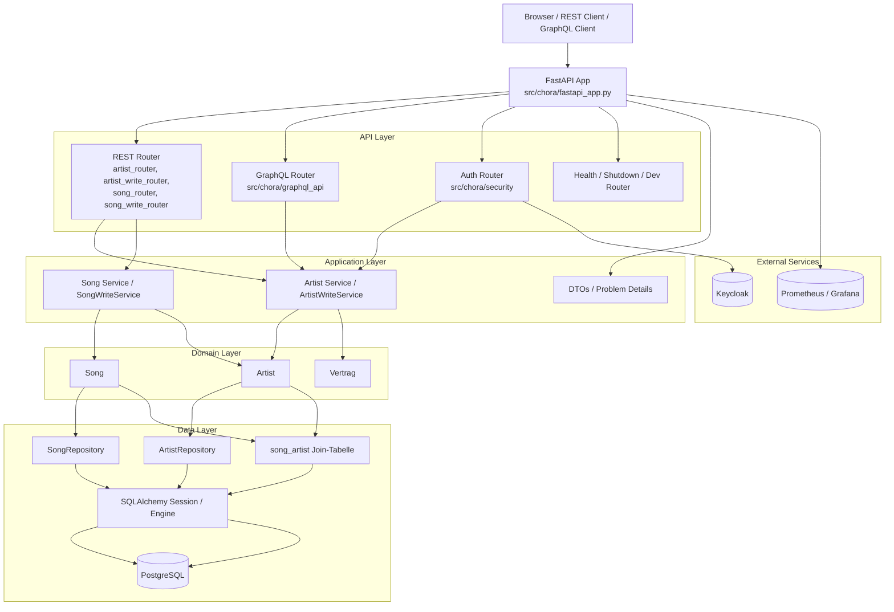

# Chora

Chora ist eine FastAPI-Anwendung zur Verwaltung von Artists, Songs und Verträgen.
Die Anwendung stellt REST- und GraphQL-Schnittstellen bereit, nutzt PostgreSQL für
die Persistenz und Keycloak für die Authentifizierung. Zusätzlich sind Health-,
Shutdown- und Dev-Endpunkte sowie Prometheus-Metriken integriert. Songs und
Artists sind dabei über eine M:N-Beziehung verbunden.

## Architektur



## Was die Anwendung abdeckt

- `Artist` als zentrales Aggregat mit 1:1-Beziehung zu `Vertrag`
- `Song` als eigenständiges Aggregat mit M:N-Beziehung zu `Artist`
- REST für Lesen und Schreiben von Artists und Songs
- GraphQL für flexible Abfragen
- Authentifizierung und Autorisierung über Keycloak
- Persistenz über SQLAlchemy und PostgreSQL
- Metriken für Prometheus

## API-Übersicht

Basis-URL lokal: `https://127.0.0.1:8000`

### REST-Endpunkte

#### Artists

| Methode | Pfad | Auth | Was kann man damit machen? | Typische Antwort |
| --- | --- | --- | --- | --- |
| GET | `/rest/artists/{artist_id}` | offen | Lädt einen Artist per ID und liefert `ETag` für Cache-/Versionsprüfung | `200` JSON-Objekt + `ETag`, oder `304` bei passendem `If-None-Match` |
| GET | `/rest/artists` | offen | Sucht Artists nach Query-Parametern wie `name`, `email`, `page`, `size` | `200` Page-JSON mit `content` und Meta-Feldern |
| POST | `/rest/artists` | offen | Legt einen Artist an und kann direkt Vertrag sowie Songs zuordnen | `201` ohne Body, `Location` zeigt auf neue Ressource |
| PUT | `/rest/artists/{artist_id}` | `ADMIN` oder `USER` | Ersetzt einen Artist vollständig, inklusive optionaler Vertrags- und Song-Zuordnungen | `204` ohne Body, neues `ETag`; Fehler z.B. `428`/`412` bei Headerproblemen |
| PATCH | `/rest/artists/{artist_id}` | `ADMIN` oder `USER` | Ändert nur ausgewählte Artist-Felder und kann Zuordnungen gezielt anpassen | `204` ohne Body, neues `ETag` |
| DELETE | `/rest/artists/{artist_id}` | `ADMIN` | Entfernt einen Artist und löst die Zuordnungen in den abhängigen Tabellen auf | `204` ohne Body |

#### Songs

| Methode | Pfad | Auth | Was kann man damit machen? | Typische Antwort |
| --- | --- | --- | --- | --- |
| GET | `/rest/songs` | offen | Listet Songs mit Pagination, optional gefiltert über `artist_id` | `200` Page-JSON mit `content` und Meta-Feldern |
| GET | `/rest/songs/{song_id}` | offen | Lädt einen Song per ID, optional im Kontext eines Artists über `artist_id` | `200` Song-JSON |
| POST | `/rest/songs` | `ADMIN` oder `USER` | Legt einen Song an und verknüpft ihn direkt mit einer oder mehreren Artists über `artist_ids` | `201` ohne Body, `Location` zeigt auf neue Ressource |
| PUT | `/rest/songs/{song_id}` | `ADMIN` oder `USER` | Ersetzt einen Song vollständig und aktualisiert die Artist-Zuordnungen | `204` ohne Body |
| DELETE | `/rest/songs/{song_id}` | `ADMIN` oder `USER` | Löscht einen Song und entfernt die Zuordnungen in der Join-Tabelle | `204` ohne Body |

#### Auth, Betrieb und Dev

| Methode | Pfad | Auth | Was kann man damit machen? | Typische Antwort |
| --- | --- | --- | --- | --- |
| POST | `/auth/token` | keine Rollen notwendig | Meldet Benutzer mit Username und Passwort an und liefert ein JWT mit Rollen | `200` JSON mit `token`, `expires_in`, `rollen` |
| GET | `/health/liveness` | offen | Prüft, ob der Prozess läuft | `200` `{ "status": "up" }` |
| GET | `/health/readiness` | offen | Prüft die Datenbankverbindung mit `SELECT 1` | `200` `{ "db": "up" }` oder `{ "db": "down" }` |
| POST | `/admin/shutdown` | `ADMIN` | Stoppt den Serverprozess kontrolliert | `200` mit Hinweis-JSON |
| POST | `/dev/db_populate` | `ADMIN` (nur Dev-Modus) | Lädt die Beispieldaten in die Datenbank neu | `200` `{ "db_populate": "success" }` |
| POST | `/dev/keycloak_populate` | `ADMIN` (nur Dev-Modus) | Lädt die Beispiel-User und Rollen in Keycloak neu | `200` `{ "keycloak_populate": "success" }` |
| GET | `/metrics` | offen | Stellt Prometheus-Metriken für Scraping bereit | `200` Textformat für Prometheus |

### GraphQL-Endpunkt

- Endpoint: `/graphql`
- Zugriff: typischerweise `POST` für Queries/Mutations, `GET` für IDE je nach Konfiguration

GraphQL bietet aktuell vor allem Zugriff auf Artists und die Anmeldung:

- `artist(artistId)` lädt einen einzelnen Artist.
- `artists(suchparameter)` sucht Artists über Filter wie Name, Genre, Alter und E-Mail.
- `create(artistInput)` legt einen Artist inklusive Vertrag und Songs an.
- `login(username, password)` liefert Token und Rollen.

Beispiele:

```graphql
query ArtistById {
  artist(artistId: "1000") {
    id
    name
    email
    vertrag {
      firma
      gehalt
    }
    songs {
      id
      titel
    }
  }
}
```

```graphql
mutation CreateArtist {
  create(
    artistInput: {
      name: "Max Example"
      geburtsdatum: "1995-03-14"
      email: "max@example.org"
      username: "max"
      vertrag: {
        artistId: 0
        startdatum: "2025-01-01"
        enddatum: "2026-01-01"
        dauer: 12
        firma: "Label GmbH"
        gehalt: 2500
      }
      songs: []
    }
  ) {
    id
  }
}
```

Antwortcharakteristik GraphQL:

- Query `artist`: einzelnes Objekt oder `null` (z.B. nicht gefunden/nicht autorisiert)
- Query `artists`: Liste, bei fehlender Berechtigung leer
- Mutation `create`: Payload mit neuer ID
- Mutation `login`: Token + Rollen für den Client

### Fehlerbilder (übergreifend)

- `401 Unauthorized`: Login fehlgeschlagen oder Token ungültig
- `403 Forbidden`: Rolle nicht ausreichend
- `404 Not Found`: Ressource nicht vorhanden
- `412 Precondition Failed`: Version/If-Match ungültig
- `422 Unprocessable Entity`: Validierung, z.B. doppelte Email/Username
- `428 Precondition Required`: If-Match fehlt bei versionsgesicherten Updates

## Projektstruktur

- `src/chora/entity`: SQLAlchemy-Entitäten wie `Artist`, `Song` und `Vertrag`
- `src/chora/router`: REST-Router und Request-Modelle
- `src/chora/graphql_api`: GraphQL-Schema und Resolver
- `src/chora/service`: Fachlogik und DTOs
- `src/chora/repository`: DB-Zugriff mit SQLAlchemy
- `src/chora/security`: Login, Rollen und Token-Handling
- `src/chora/config`: Konfiguration sowie SQL- und Dev-Ressourcen
- `compose/`: lokale Infrastruktur mit PostgreSQL, Keycloak, Prometheus und mehr

## Lokaler Start

```bash
uv sync --all-groups
uv run chora
```

Alternativ geht auch:

```bash
uv run python -m chora
```

Standardmäßig lauscht der Server auf `127.0.0.1:8000`, sofern in der
Konfiguration nichts anderes gesetzt ist.

## Prüfen und Entwickeln

```bash
uv run pytest
uvx ruff check src tests
uvx ruff format src tests
uvx ty check src tests
```

## Hinweise zur Entwicklung

- Die DB-Struktur liegt in `src/chora/config/resources/postgresql/create.sql`.
- Das passende Zurücksetzen der Tabellen passiert über `drop.sql`.
- Die M:N-Verknüpfung zwischen Songs und Artists liegt in der Tabelle `song_artist`.
- Im Dev-Modus können DB und Keycloak automatisch vorbefüllt werden.
- OpenAPI ist unter `https://127.0.0.1:8000/docs` verfügbar.

## Kurz gesagt

Chora ist eine schlanke, schichtenbasierte FastAPI-Anwendung mit klarer Trennung
zwischen API, Fachlogik, Persistenz und externer Infrastruktur.
