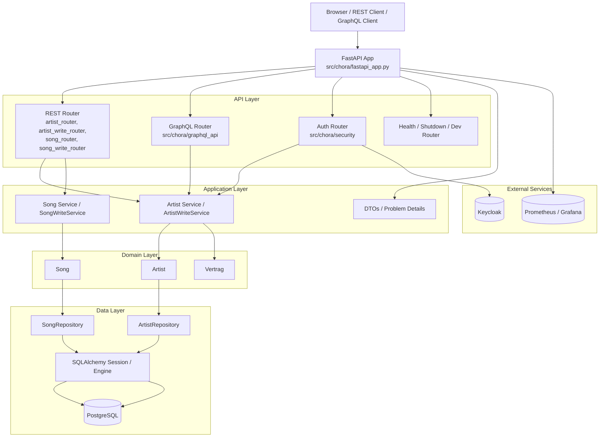

# Chora

Chora ist eine FastAPI-Anwendung zur Verwaltung von Artists, Songs und Vertraegen.
Die Anwendung stellt REST- und GraphQL-Schnittstellen bereit, nutzt PostgreSQL fuer
die Persistenz und Keycloak fuer die Authentifizierung. Zusaetzlich sind Health-,
Shutdown- und Dev-Endpunkte sowie Prometheus-Metriken integriert.

## Architektur



## Was die Anwendung abdeckt

- `Artist` als zentrales Aggregat mit 1:1-Beziehung zu `Vertrag`
- `Song` als 1:n-Beziehung zu `Artist`
- REST fuer Lesen und Schreiben
- GraphQL fuer flexible Abfragen
- Authentifizierung und Autorisierung ueber Keycloak
- Persistenz ueber SQLAlchemy und PostgreSQL
- Metriken fuer Prometheus

## API-Uebersicht

Basis-URL lokal: `https://127.0.0.1:8000`

### REST-Endpunkte

| Methode | Pfad | Auth | Was zeichnet ihn aus | Typische Antwort |
|---|---|---|---|---|
| GET | `/rest/artists/{artist_id}` | User im Request-Kontext | Liefert einen Artist mit ETag-Semantik | `200` JSON-Objekt + `ETag`, oder `304` bei passendem `If-None-Match` |
| GET | `/rest/artists` | User im Request-Kontext | Suche per Query (`name`, `email`) + Pagination (`page`, `size`) | `200` Page-JSON mit `content` und Meta-Feldern |
| POST | `/rest/artists` | offen (fachlich validiert) | Legt Artist inkl. Vertrag/Songs an | `201` ohne Body, `Location` zeigt auf neue Ressource |
| PUT | `/rest/artists/{artist_id}` | `ADMIN` oder `USER` | Vollstaendiges Update mit Versionskontrolle | `204` ohne Body, neues `ETag`; Fehler z.B. `428`/`412` bei Headerproblemen |
| PATCH | `/rest/artists/{artist_id}` | `ADMIN` oder `USER` | Partielles Update mit Versionskontrolle | `204` ohne Body, neues `ETag` |
| DELETE | `/rest/artists/{artist_id}` | `ADMIN` | Loescht Artist inkl. abhaengiger Daten per FK-Cascade | `204` ohne Body |
| GET | `/rest/artists/{artist_id}/songs/{song_id}` | User im Request-Kontext | Liest genau einen Song eines Artists | `200` Song-JSON |
| GET | `/rest/artists/{artist_id}/songs` | User im Request-Kontext | Song-Liste eines Artists mit Pagination | `200` Page-JSON mit Songs |
| POST | `/rest/artists/{artist_id}/songs` | `ADMIN` oder `USER` | Legt Song fuer Artist an | `201` ohne Body, `Location` auf neuen Song |
| PUT | `/rest/artists/{artist_id}/songs/{song_id}` | `ADMIN` oder `USER` | Ersetzt Song-Daten | `204` ohne Body |
| DELETE | `/rest/artists/{artist_id}/songs/{song_id}` | `ADMIN` oder `USER` | Loescht Song | `204` ohne Body |
| POST | `/auth/token` | keine Rollen notwendig | Login mit Username/Passwort, liefert JWT + Rollen | `200` JSON mit `token`, `expires_in`, `rollen` |
| GET | `/health/liveness` | offen | Prozess-Liveness fuer Orchestrierung | `200` `{ "status": "up" }` |
| GET | `/health/readiness` | offen | DB-Readiness via `SELECT 1` | `200` `{ "db": "up" }` oder `{ "db": "down" }` |
| POST | `/admin/shutdown` | `ADMIN` | Stoppt den Server-Prozess | `200` mit Hinweis-JSON |
| POST | `/dev/db_populate` | `ADMIN` (nur Dev-Modus) | Laedt DB-Testdaten neu | `200` `{ "db_populate": "success" }` |
| POST | `/dev/keycloak_populate` | `ADMIN` (nur Dev-Modus) | Laedt Keycloak-Testdaten neu | `200` `{ "keycloak_populate": "success" }` |
| GET | `/metrics` | offen | Prometheus-Metriken | `200` Textformat fuer Scraping |

### GraphQL-Endpunkt

- Endpoint: `/graphql`
- Zugriff: typischerweise `POST` fuer Queries/Mutations, `GET` fuer IDE je nach Konfiguration

Beispiele:

```graphql
query ArtistById {
	artist(artistId: "1000") {
		id
		name
		email
		vertrag {
			firma
			gehalt
		}
		songs {
			id
			titel
		}
	}
}
```

```graphql
mutation CreateArtist {
	create(
		artistInput: {
			name: "Max Example"
			geburtsdatum: "1995-03-14"
			email: "max@example.org"
			username: "max"
			vertrag: {
				artistId: 0
				startdatum: "2025-01-01"
				enddatum: "2026-01-01"
				dauer: 12
				firma: "Label GmbH"
				gehalt: 2500
			}
			songs: []
		}
	) {
		id
	}
}
```

Antwortcharakteristik GraphQL:

- Query `artist`: einzelnes Objekt oder `null` (z.B. nicht gefunden/nicht autorisiert)
- Query `artists`: Liste, bei fehlender Berechtigung leer
- Mutation `create`: Payload mit neuer ID
- Mutation `login`: Token + Rollen fuer den Client

### Fehlerbilder (uebergreifend)

- `401 Unauthorized`: Login fehlgeschlagen oder Token ungueltig
- `403 Forbidden`: Rolle nicht ausreichend
- `404 Not Found`: Ressource nicht vorhanden
- `412 Precondition Failed`: Version/If-Match ungueltig
- `422 Unprocessable Entity`: Validierung, z.B. doppelte Email/Username
- `428 Precondition Required`: If-Match fehlt bei versionsgesicherten Updates

## Projektstruktur

- `src/chora/entity`: SQLAlchemy-Entitaeten wie `Artist`, `Song` und `Vertrag`
- `src/chora/router`: REST-Router und Request-Modelle
- `src/chora/graphql_api`: GraphQL-Schema und Resolver
- `src/chora/service`: Fachlogik und DTOs
- `src/chora/repository`: DB-Zugriff mit SQLAlchemy
- `src/chora/security`: Login, Rollen und Token-Handling
- `src/chora/config`: Konfiguration sowie SQL- und Dev-Ressourcen
- `compose/`: lokale Infrastruktur mit PostgreSQL, Keycloak, Prometheus und mehr

## Lokaler Start

```bash
uv sync --all-groups
uv run chora
```

Alternativ geht auch:

```bash
uv run python -m chora
```

Standardmaessig lauscht der Server auf `127.0.0.1:8000`, sofern in der
Konfiguration nichts anderes gesetzt ist.

## Pruefen und Entwickeln

```bash
uv run pytest
uvx ruff check src tests
uvx ruff format src tests
uvx ty check src tests
```

## Hinweise zur Entwicklung

- Die DB-Struktur liegt in `src/chora/config/resources/postgresql/create.sql`.
- Das passende Zuruecksetzen der Tabellen passiert ueber `drop.sql`.
- Im Dev-Modus koennen DB und Keycloak automatisch vorbefuellt werden.
- OpenAPI ist unter `https://127.0.0.1:8000/docs` verfuegbar.

## Mermaid in VS Code und GitHub

Kurz: Ja, das kann sich unterscheiden.

- GitHub rendert Mermaid in `README.md` nativ.
- VS Code zeigt Mermaid nur dann gerendert, wenn die Markdown-Vorschau Mermaid unterstuetzt.
- In der reinen Textansicht siehst du immer nur den Mermaid-Codeblock.

Wenn du in VS Code keine Renderung siehst:

1. Markdown-Vorschau oeffnen (`Ctrl+Shift+V`).
2. Sicherstellen, dass Mermaid in der Vorschau aktiv ist (je nach VS-Code-Version/Setup).
3. Optional eine Mermaid-Extension installieren, falls dein Setup es nicht nativ rendert.

## Kurz gesagt

Chora ist eine schlanke, schichtenbasierte FastAPI-Anwendung mit klarer Trennung
zwischen API, Fachlogik, Persistenz und externer Infrastruktur.